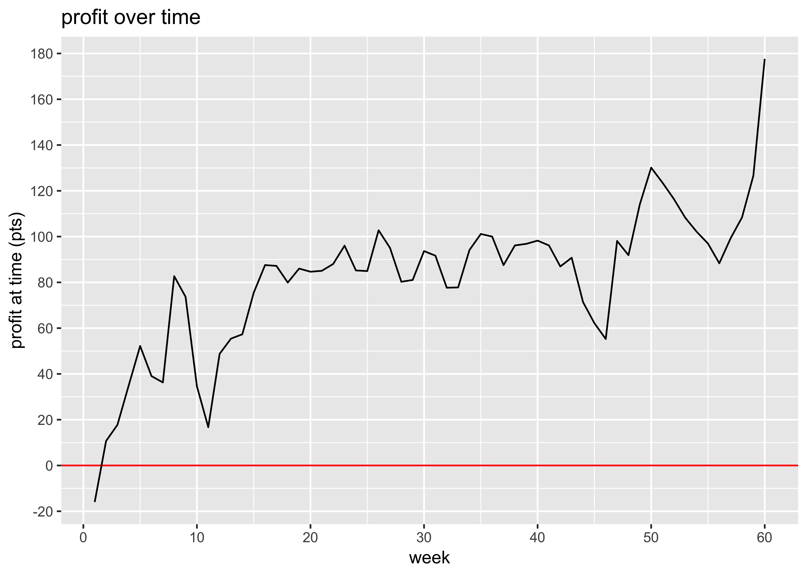
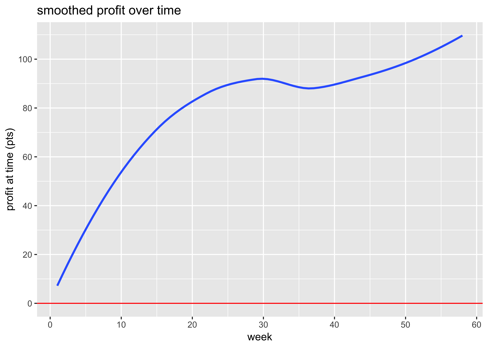

report
================
2018-10-18

# Profit over time

<!-- -->

<!-- -->

# ROI and ROC

We put in €9000 and we’ve made a profit of €4,998 on the bets. However,
we’ve paid three subscriptions of £600 which amounts to €2,050 so our
net profit is €2,948. That’s a return on capital of 32.76%.

We have wagered a total of €50,257 and made a betting profit of €4,998,
which gives us a betting ROI of 9.94%.

# Have any bookies been riddled?

| bookmaker    | Aidan | Rory | total |
| :----------- | :---- | :--- | :---- |
| Paddy Power  | \+48  | \-6  | \+42  |
| Bet365       | 0     | \+36 | \+36  |
| Betfred      | \+6   | \+17 | \+23  |
| William Hill | \+22  | \-3  | \+19  |
| Unibet       | \+3   | \+13 | \+17  |
| Coral        | \+17  | 0    | \+17  |
| Matchbook    | \+10  | \+2  | \+12  |
| SportingBet  | 0     | \+10 | \+10  |
| NA           | \+9   | 0    | \+9   |
| LC Matchbook | 0     | \+7  | \+7   |
| Marathon     | 0     | \+3  | \+3   |
| JuJu         | \+1   | 0    | \+1   |
| Betway       | 0     | 0    | 0     |
| SkyBet       | 0     | \-1  | \-1   |
| SunBets      | \-4   | \+3  | \-1   |
| Boylesports  | \-1   | 0    | \-1   |
| BetVictor    | 0     | \-3  | \-3   |
| 188Bet       | \-2   | \-3  | \-4   |
| BoyleSports  | \-5   | 0    | \-5   |
| 888Sport     | 0     | \-5  | \-5   |
| 10Bet        | 0     | \-6  | \-6   |
| Betfair SB   | \-1   | \-5  | \-6   |
| SportsPesa   | 0     | \-6  | \-6   |
| BetStars     | \-2   | \-9  | \-10  |
| Black Type   | 0     | \-17 | \-17  |
| Ladbrokes    | 0     | \-18 | \-18  |

bookie profits (pts)

# Minimum acceptable odds

We’ve had winnings of 845 points and losses of 732 points, so even if
our odds were only a fraction 732 / 845 = 0.87 of what we actually got,
we’d still be breaking even.

# Winners and losers

Here’s a count of the number of winners, losers, and places we’ve had.

| result         |   n | percent |
| :------------- | --: | :------ |
| Win only Lose  | 303 | 64%     |
| Win only Win   |  92 | 19%     |
| Each way Lose  |  61 | 13%     |
| Each way Place |   9 | 2%      |
| Each way Win   |   9 | 2%      |
| Win only um    |   2 | 0%      |

# Win only vs each way

  - We’ve made 361 *win only* bets, on which we’ve made a profit of
    €6,412.
  - We’ve made 72 *each way* bets, on which we’ve made a profit of
    €-1,415.
