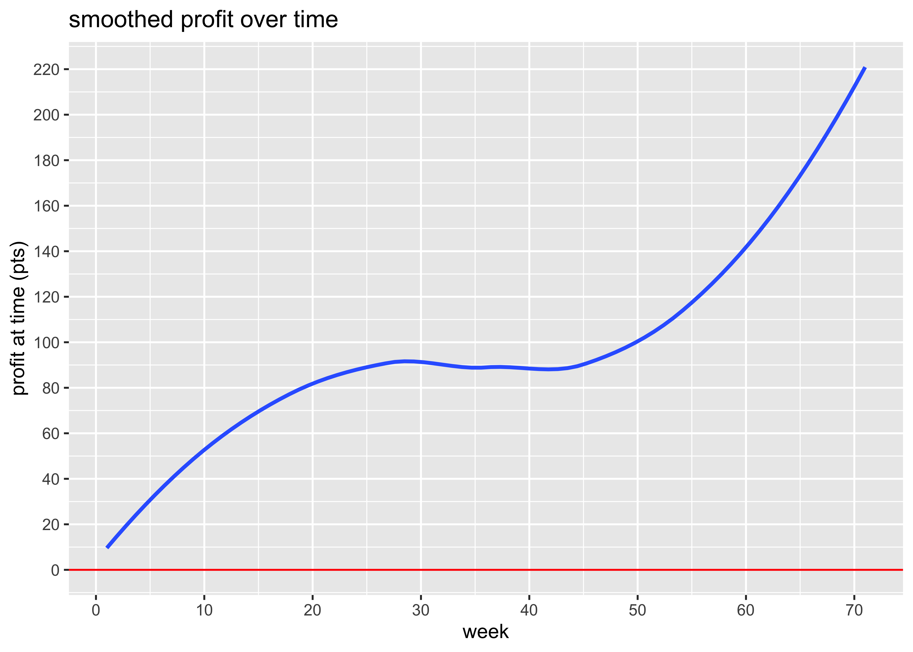

report
================
2018-09-27

# Profit over time

<!-- -->

<!-- -->

# ROI and ROC

We put in €9000 and we’ve made a profit of €4,092 on the bets. However,
we’ve paid two subscriptions of £600 which amounts to €1,345 so our net
profit is €2,747. That’s a return on capital of 30.52%.

We have wagered a total of €46,210 and made a betting profit of €4,092,
which gives us a betting ROI of 8.86%.

# Have any bookies been riddled?

| bookmaker    | Aidan | Rory | total |
| :----------- | :---- | :--- | :---- |
| Bet365       | 0     | \+36 | \+36  |
| Paddy Power  | \+37  | \-8  | \+29  |
| Betfred      | \+6   | \+15 | \+21  |
| William Hill | \+23  | \-3  | \+20  |
| Unibet       | \+4   | \+16 | \+20  |
| Coral        | \+14  | 0    | \+14  |
| Matchbook    | \+12  | \+2  | \+14  |
| LC Matchbook | 0     | \+10 | \+10  |
| SportingBet  | 0     | \+10 | \+10  |
| JuJu         | \+1   | 0    | \+1   |
| Boylesports  | \+1   | 0    | \+1   |
| Betway       | 0     | 0    | 0     |
| SkyBet       | 0     | \-1  | \-1   |
| Marathon     | 0     | \-1  | \-1   |
| SunBets      | \-4   | \+3  | \-1   |
| 188Bet       | \+1   | \-3  | \-2   |
| BetVictor    | 0     | \-3  | \-3   |
| 888Sport     | 0     | \-5  | \-5   |
| 10Bet        | 0     | \-5  | \-5   |
| SportsPesa   | 0     | \-6  | \-6   |
| BetStars     | 0     | \-9  | \-9   |
| Black Type   | 0     | \-14 | \-14  |
| Ladbrokes    | 0     | \-18 | \-18  |
| Betfair SB   | \-15  | \-4  | \-18  |

bookie profits (pts)

# Minimum acceptable odds

We’ve had winnings of 771 points and losses of 676 points, so even if
our odds were only a fraction 676 / 771 = 0.88 of what we actually got,
we’d still be breaking even.

# Winners and losers

Here’s a count of the number of winners, losers, and places we’ve had.

| result         |   n | percent |
| :------------- | --: | :------ |
| Win only Lose  | 272 | 64%     |
| Win only Win   |  80 | 19%     |
| Each way Lose  |  57 | 13%     |
| Each way Place |   9 | 2%      |
| Each way Win   |   6 | 1%      |

# Win only vs each way

  - We’ve made 325 *win only* bets, on which we’ve made a profit of
    €5,921.
  - We’ve made 67 *each way* bets, on which we’ve made a profit of
    €-1,829.
