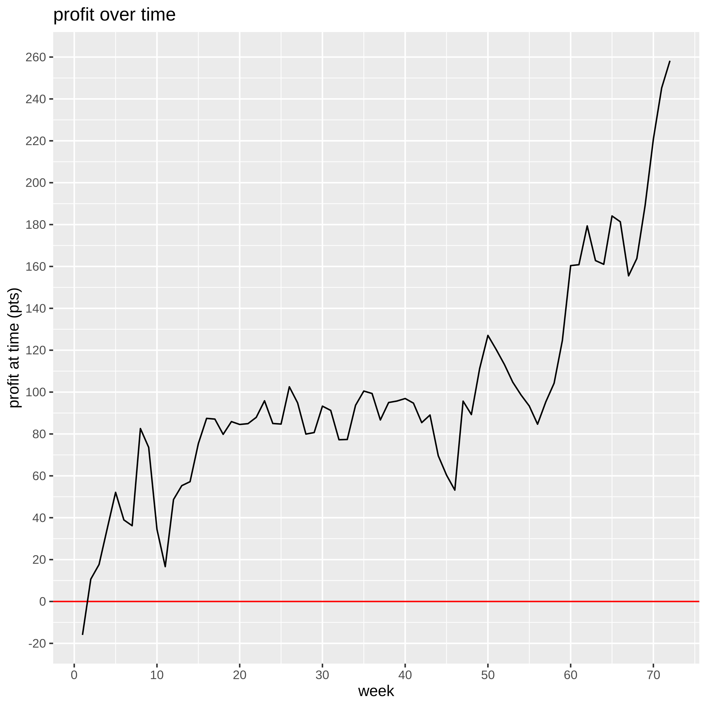

# Profit over time

# ROI and ROC

We put in €9000 and we've made a profit of €8,110 on the bets. However, we've paid three subscriptions of £600 which amounts to €2,003 so our net profit is €6,107. That's a return on capital of 67.86%. This gives us a current bank of €15107.

We have wagered a total of €105,669 and made a betting profit of €8,110, which gives us a betting ROI of 7.67%.

# Have any bookies been riddled?

|bookmaker    |Aidan |David |Rory |total |
|:------------|:-----|:-----|:----|:-----|
|Unibet       |+17   |0     |+55  |+72   |
|Matchbook    |+60   |0     |+5   |+66   |
|Betfred      |+20   |0     |+29  |+49   |
|Paddy Power  |+45   |0     |+1   |+46   |
|Bet365       |0     |-3    |+36  |+36   |
|SkyBet       |+20   |0     |-1   |+20   |
|SportingBet  |0     |+2    |+10  |+10   |
|10Bet        |+14   |0     |-6   |+8    |
|NA           |0     |0     |+7   |+7    |
|Coral        |+5    |-2    |-1   |+5    |
|SpreadEx     |+3    |0     |0    |+3    |
|Marathon     |0     |0     |+2   |+2    |
|Betway       |0     |-2    |-1   |-1    |
|Betstars     |-1    |0     |0    |-1    |
|Uniber       |0     |0     |-1   |-1    |
|SunBets      |-4    |0     |+3   |-1    |
|BetBright    |0     |0     |-1   |-1    |
|Redzone      |0     |0     |-1   |-1    |
|HC Matchbook |-1    |0     |-1   |-2    |
|SportNation  |0     |0     |-2   |-2    |
|BetVictor    |0     |0     |-3   |-3    |
|Various      |-3    |0     |-1   |-4    |
|BoyleSports  |-5    |0     |0    |-5    |
|888Sport     |0     |-1    |-5   |-5    |
|Boylesports  |-6    |0     |0    |-6    |
|SportsPesa   |0     |0     |-6   |-6    |
|188Bet       |-3    |0     |-4   |-6    |
|William Hill |-6    |0     |-4   |-10   |
|BetStars     |-2    |0     |-9   |-10   |
|RedZone      |0     |0     |-11  |-11   |
|Ladbrokes    |0     |+5    |-18  |-18   |
|Black Type   |0     |0     |-26  |-26   |
|Betfair SB   |-24   |0     |-12  |-36   |

# Minimum acceptable odds

We've had winnings of 1564 points and losses of 1397 points, so even if our odds were only a fraction 1397 / 1564 = 0.89 of what we actually got, we'd still be breaking even.

# Winners and losers

Here's a count of the number of winners, losers, and places we've had.

|result                  |    n|percent |
|:-----------------------|----:|:-------|
|Win only Lose           | 1085|71%     |
|Win only Win            |  217|14%     |
|Each way Lose           |  108|7%      |
|Win only Unmatched Loss |   49|3%      |
|Each way Place          |   37|2%      |
|Each way Win            |   19|1%      |
|Win only Unmatched Win  |   13|1%      |
|Each way Unmatched Loss |    1|0%      |

# Win only vs each way

* We've made 771 _win only_ bets, on which we've made a profit of €7,697. 
* We've made 103 _each way_ bets, on which we've made a profit of €413.

# Unmatched Bets

We'll consider only win only bets (and not each way bets) in this section.

Of the bets that have been matched, there have been 141 winners and 621 losers. That means that 19% of matched bets have been winners. Of the bets that have not been matched, there have been 13 winners and 49 losers. That means that 21% of unmatched bets have been winners. Unmatched bets have saved us 48 points on losers but cost us 81 on winners, whereas getting better odds on posted bets which were matched has made us 62 points (where I have assumed that when we post, we get 20% better odds than if we'd just taken best available at the time). So overall, choosing to post when we do (rather than taking the bad bbest available odds) has saved us 29 points.
