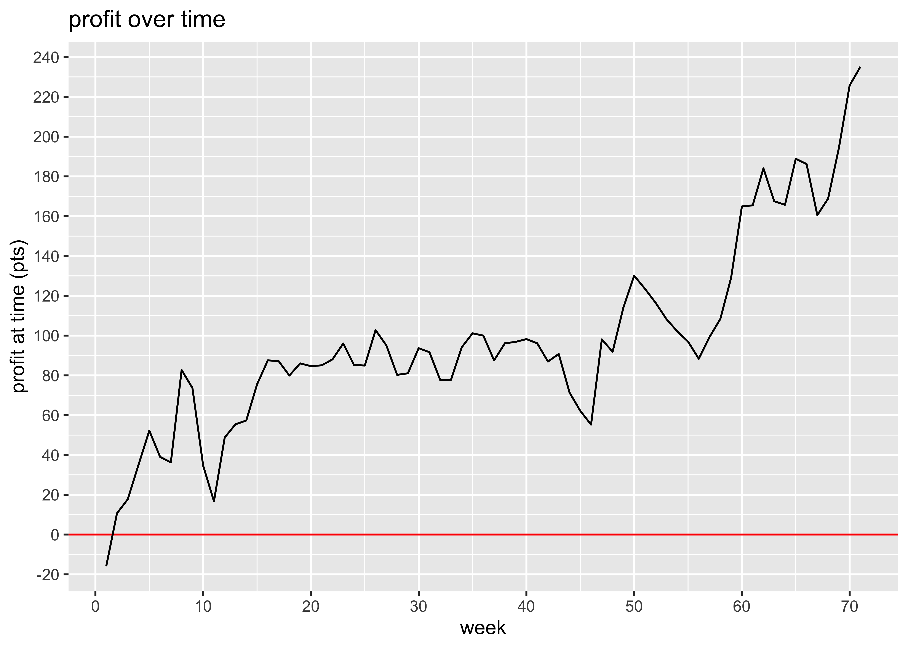

report
================
2019-06-10 22:34:53

# Profit over time

<!-- -->

<!-- -->

# ROI and ROC

We put in €9000 and we’ve made a profit of €8,705 on the bets. However,
we’ve paid three subscriptions of £600 which amounts to €2,023 so our
net profit is €6,682. That’s a return on capital of 74.24%. This gives
us a current bank of €15682.

We have wagered a total of €98,373 and made a betting profit of €8,705,
which gives us a betting ROI of 8.85%.

# Have any bookies been riddled?

| bookmaker    | Aidan | Rory | total |
| :----------- | :---- | :--- | :---- |
| Unibet       | \+18  | \+55 | \+72  |
| Betfred      | \+20  | \+36 | \+56  |
| Matchbook    | \+38  | \+12 | \+50  |
| Paddy Power  | \+42  | \+1  | \+43  |
| Bet365       | 0     | \+36 | \+36  |
| SkyBet       | \+14  | \-1  | \+13  |
| SportingBet  | 0     | \+10 | \+10  |
| 10Bet        | \+14  | \-6  | \+8   |
| NA           | 0     | \+7  | \+7   |
| SpreadEx     | \+6   | 0    | \+6   |
| Coral        | \+5   | 0    | \+5   |
| William Hill | \+6   | \-4  | \+3   |
| Marathon     | 0     | \+2  | \+2   |
| Betway       | 0     | 0    | 0     |
| HC Matchbook | 0     | \-1  | \-1   |
| Betstars     | \-1   | 0    | \-1   |
| Uniber       | 0     | \-1  | \-1   |
| SunBets      | \-4   | \+3  | \-1   |
| BetBright    | 0     | \-1  | \-1   |
| SportNation  | 0     | \-2  | \-2   |
| BetVictor    | 0     | \-3  | \-3   |
| RedZone      | 0     | \-3  | \-3   |
| LC Matchbook | 0     | \-3  | \-3   |
| Various      | \-3   | \-1  | \-4   |
| BoyleSports  | \-5   | 0    | \-5   |
| 888Sport     | 0     | \-5  | \-5   |
| Boylesports  | \-6   | 0    | \-6   |
| SportsPesa   | 0     | \-6  | \-6   |
| 188Bet       | \-3   | \-4  | \-6   |
| BetStars     | \-2   | \-9  | \-10  |
| Ladbrokes    | 0     | \-18 | \-18  |
| Black Type   | 0     | \-25 | \-25  |
| Betfair SB   | \-24  | \-8  | \-33  |

# Minimum acceptable odds

We’ve had winnings of 1481 points and losses of 1303 points, so even if
our odds were only a fraction 1303 / 1481 = 0.88 of what we actually
got, we’d still be breaking even.

# Winners and losers

Here’s a count of the number of winners, losers, and places we’ve had.

| result                  |   n | percent |
| :---------------------- | --: | :------ |
| Win only Lose           | 944 | 69%     |
| Win only Win            | 195 | 14%     |
| Each way Lose           | 108 | 8%      |
| Win only Unmatched Loss |  45 | 3%      |
| Each way Place          |  37 | 3%      |
| Each way Win            |  19 | 1%      |
| Win only Unmatched Win  |  13 | 1%      |
| Each way Unmatched Loss |   1 | 0%      |

# Win only vs each way

  - We’ve made 706 *win only* bets, on which we’ve made a profit of
    €8,299.
  - We’ve made 103 *each way* bets, on which we’ve made a profit of
    €406.

# Unmatched Bets

We’ll consider only win only bets (and not each way bets) in this
section.

Of the bets that have been matched, there have been 133 winners and 563
losers. That means that 19% of matched bets have been winners. Of the
bets that have not been matched, there have been 13 winners and 45
losers. That means that 22% of unmatched bets have been winners.
Unmatched bets have saved us 43 points on losers but cost us 80 on
winners, whereas getting better odds on posted bets which were matched
has made us 53 points (where I have assumed that when we post, we get
20% better odds than if we’d just taken best available at the time). So
overall, choosing to post when we do (rather than taking the bad bbest
available odds) has saved us 16 points.
